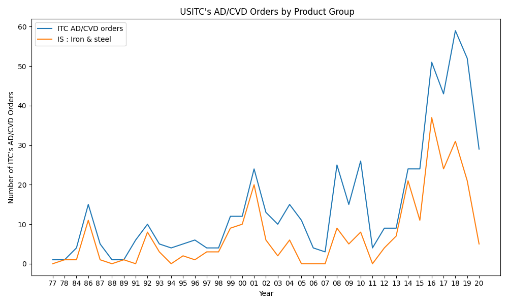
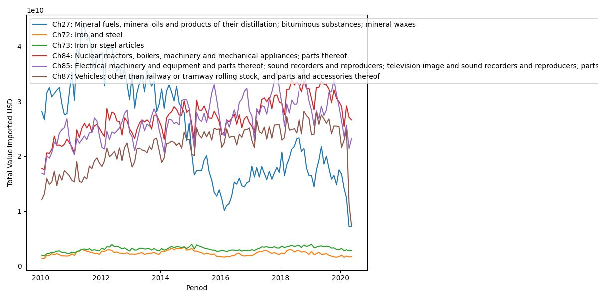
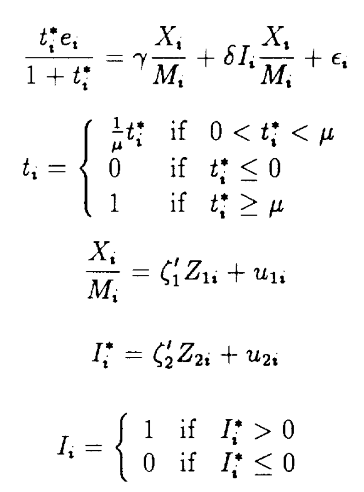

# Import Penetration and Protection  
### What looks Unusual : Steel Industry's High Protection Compared to Its Relative Import Volume
- Why are the ratio of steel-related antidumping orders are too high given its relatively low import volume?

## Literature
Models are mainly arguing over the negative/postivie correlation between `import penetration ratio` and `protection level`
- Theoretical Modelling: 
    1) Deductively designed model that supports the author's argument
    2) No actual data (observation) is used. 
  - [Protection for sale (Grossman and Helpman, 1994; 5855)](https://sci-hub.st/https://www.jstor.org/stable/2118033) 
    - a.k.a GH model
    - **"(If the industry is organized; Reprsented by the lobby) Trade protection decreases with import penetration"** 
    - **"(If the industry is non-organized; Reprsented by the lobby) Trade protection increases with import penetration"**
  - [Import penetration and the politics of trade protection (Maggia, 2000; 113)](https://sci-hub.st/https://www.sciencedirect.com/science/article/pii/S002219969900029X)
    - **"Trade protection increases (strictly) with import penetration."**
  - Many other papers are generally supporting "protection tends to be higher in higher import penetration"
- Emprical Validation
  - [Protection for Sale: An Empirical Investigation (Goldberg & Maggi, 1997; 1056)](https://www.nber.org/papers/w5942.pdf)
    - data used only covers a year (1983)
    - not stricitly and directly validates the GH model. 
    - used NTB (Non-tariff Barrier) data (because tariff-rates are determined "cooperatively" in the GATT-WTO regime.
    - used manufacturing sector's data only
    - Observations: 107
{:height="36px" width="36px"}.

## Questions
- Literature I covered is fairly outdated.. any recent re-visit about this subject? 
- 
