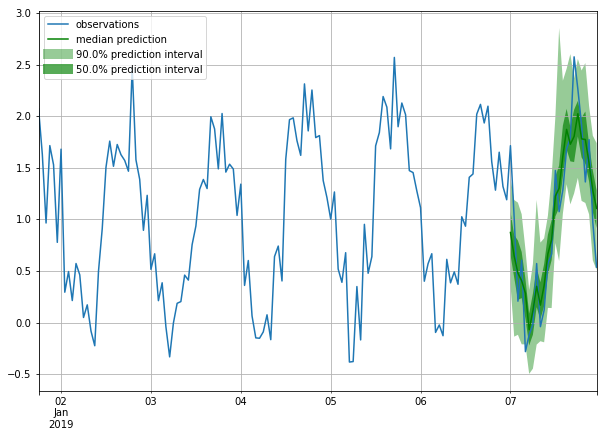

# Import Penetration and Protection  
### What looks Unusual : Steel Industry's High Protection Compared to Its Relative Import Volume
- Why are the ratio of steel-related antidumping orders are too high given its relatively low import volume?

## Literature
Models are mainly arguing over the negative/postivie correlation between `import penetration ratio` and `protection level`
- Theoretical Modelling: 
    1) Deductively designed model that supports the author's argument
    2) No actual data (observation) is used. 
  - [Protection for sale (Grossman and Helpman, 1994; 5855)](https://sci-hub.st/https://www.jstor.org/stable/2118033) 
    - a.k.a GH model
    - **"(If the industry is organized; Reprsented by the lobby) Trade protection decreases with import penetration"** 
    - **"(If the industry is non-organized; Reprsented by the lobby) Trade protection increases with import penetration"**
  - [Import penetration and the politics of trade protection (Maggia, 2000; 113)](https://sci-hub.st/https://www.sciencedirect.com/science/article/pii/S002219969900029X)
    - **"Trade protection increases (strictly) with import penetration."**
  - Many other papers are generally supporting "protection tends to be higher in higher import penetration"
- Emprical Validation
  - [Protection for Sale: An Empirical Investigation (Goldberg & Maggi, 1997; 1056)](https://www.nber.org/papers/w5942.pdf)
    - data used only contains one-year annual data (1983; NBER data) 
    - SIC 3digit level 
    - not stricitly and directly validates the GH model. 
    - used NTB (Non-tariff Barrier) data (because tariff-rates are determined "cooperatively" in the GATT-WTO regime.
    - used manufacturing sector's data only
    - Observations: 107

<\p>

- I is for organized sector (Measured by "exisitence" of the PAC contribution)
- e is for import elasticity
- t is for protection
- X/M Inverse penetraion ratio where X is export and M is import

## Questions
#### Any other important & more recent literature on this topic?
- Literature above cited is fairly outdated.. any recent re-visit about this subject? 
  - is this subject still attractive to political scientist?
  - maybe I could re-visit this subject with more data (absolutely more than 107 observations, moreover in monthly level)

#### Data for Protection Level
- I could use HS-6digit level of MFN tariff data (Maybe safer or more acceptable way to perform the emprical test on this subject)

- Or, I'd like to try the [Federal Register](https://www.federalregister.gov/documents/search?conditions%5Bterm%5D=steel+import)'s Titles as a proxy for the Protection Level 
  - Counting how many times those product mentioned in the federal register
  - Will it be make sense to political scientist?

- For the model part, I could try linear regression as above, or,

- I could perform `ablation study` with `Probabilistic Forecasting models`

  <\p>

  - PF models gets the fixed `n-window sized input` and then predict next `n+t` period of output (n,t are hyperparameters)
  - I'd let the model to see the n periods of trade volume data and then predict the count of certain product group mentioned in the federal register or not. 
  - To be ablation, we could check whether the introduction of addtional `lobbied` feature (whether the product is lobbied or not for that input period of time; retrieved from lobbyview) actually increase the prediction accuracy or not.
  
